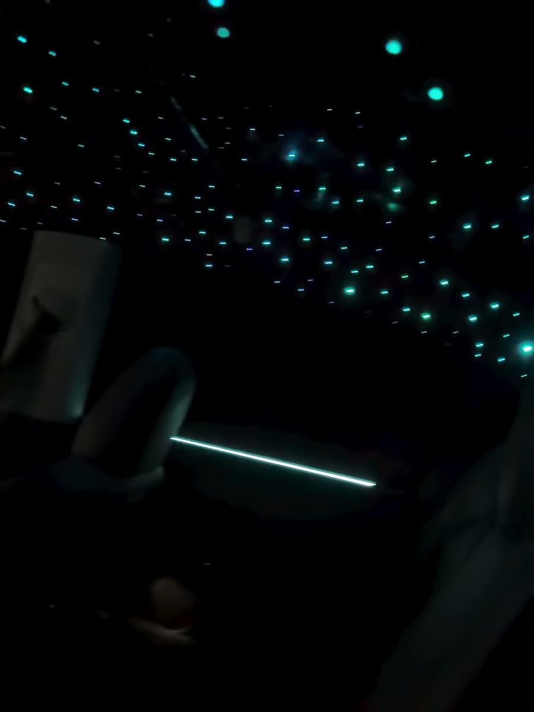

# Slick Stars

Marketing site for [Slick Stars](https://www.instagram.com/slickstars_/) — fiber-optic starlight
headliners, ambient interior lighting and suede retrims, out of Tampa, Florida.

Static site. No build step, no dependencies:

```
cd "~/Desktop/Slick Stars website" && python3 -m http.server 4188
```

| File | What it is |
|---|---|
| `index.html` | Landing page |
| `book.html` | Booking page — six-step quiz with a review screen before anything sends |
| `styles.css` | All styles for both pages |
| `app.js` | Nav, scroll reveals, star fields, the work rail + lightbox, the booking quiz |
| `video/hero.mp4` | Landing-page background &mdash; 6.5s of a headliner packed with stars, cropped to the star field itself (1080×1020) |
| `video/work/` | The twelve build clips (720×1280) and their poster frames |
| `images/work/` | Full-size stills pulled from the same clips |
| `images/services/` | The three hand-cropped stills for the install cards — **not currently on the page**, see below |
| `media/` | **Not shipped.** Originals, build script, and every screenshot taken while building |
| `CONTENT-TODO.md` | **Read this first** — every claim on the page that is still an assumption |

## Where the media came from

Everything on the page is Slick Stars' own footage. The twelve reels on `@slickstars_` were
pulled with `yt-dlp`, then re-encoded down from 1080×1920 to 720×1280 for the grid. The whole
`video/` folder is 23MB.

`media/build.sh` rebuilds every clip and poster from `media/raw/` using `media/manifest.txt`
(`shortcode|slug|poster timestamp`). Change a timestamp there and re-run it to move a poster
frame. `media/raw/` holds the untouched originals.

Poster frames were picked by hand, one clip at a time — a starlight reel spends half its
runtime on someone's face or a garage shelf, and the auto-picked frame was wrong more often
than it was right.

## Booking: real slots, no double bookings

The timing step doesn't ask for a date any more — it shows the days and times that are genuinely
open on the GoHighLevel calendar, and holds the one they pick.

| Route | |
|---|---|
| `api/slots.js` | Reads free slots off the calendar. Uncached — a slot taken thirty seconds ago is gone from the next response. |
| `api/book.js` | Upserts the contact, books the slot, creates the opportunity, attaches the note. |
| `api/_ghl.js` | Shared token lookup, IDs and fetch wrapper. Files starting with `_` aren't routes on Vercel. |

**How the double-booking guard works:** the appointment is created with
`ignoreFreeSlotValidation: false`, so the calendar itself refuses a slot that's already taken.
Two people on the page at once can both *see* 1pm; only the first to submit gets it. The second
gets the booking saved with a warning on the note rather than an error — a lead is never lost to
a race.

Appointments are created with status `new`, not `confirmed`. The site promises a price before
anything is final, so he still confirms each one himself.

Times are read out of the ISO string rather than through `Date()`, so a visitor in another
timezone still sees the shop's clock — the appointment is a physical one.

**If the calendar can't be read**, the step falls back to the old free-text date box, and if
`/api/book` fails the whole request falls back to the text/Instagram handoff. Neither failure
loses a booking.

The one environment variable to set in Vercel:

| Variable | |
|---|---|
| `GHL_api` | **required** — a Private Integration Token created *inside the Slick Stars sub-account* |

`GHL_LOCATION_ID`, `GHL_PIPELINE_ID`, `GHL_STAGE_ID`, `GHL_CALENDAR_ID` and `GHL_TIMEZONE`
override the baked-in IDs if the account is ever rebuilt. They aren't secrets — without the
token they do nothing.

### Testing it locally

`python3 -m http.server` can't run the API routes. Use:

```
GHL_api=<token> node media/dev-server.js
```

Same port, serves the static site and `/api/*` against the real account.

### The calendar itself

It currently points at **"John Doe's Personal Calendar"** — the placeholder GHL auto-created —
with 30-minute slots from 11am. The code reads whatever the calendar says, so renaming it,
setting a full-day duration and putting in his real hours needs **no code change at all**. Set
`GHL_CALENDAR_ID` if a different calendar is built instead.

## Design

Black, chrome and white. No accent color anywhere in the interface — every color on the page
comes out of the shop's own footage, which is the point: a violet cabin and a cyan star ceiling
read far louder against a page that isn't competing with them.

Display face is **DM Serif Display**, picked by Ben off a rendered sheet of ten after six other
faces were tried and dropped.

It ships one weight and an italic and nothing else, which shapes how it's used: hierarchy comes
from size and case, never from weight. The hero's second line takes the real italic — that's the
device the layout borrows from Vivid. The smallest display text is set a step larger than the
sans would need (process step titles at 21px, FAQ questions at 20px) because there's no heavier
cut to lean on; the strokes are sturdy enough on black that nothing disappears, but they want the
size.

**Instrument Sans** carries body copy, labels and every control.

The hero borrows its text layout from the Vivid Customs build: one left-aligned column, centered
in the viewport, with even 1.5rem gaps — locator, two-line headline with the second line italic,
one paragraph, two buttons (solid and ghost). Nothing is pinned to a corner and nothing runs in a
second column.

The rest of the format runs: hero over a star ceiling → three portrait install cards → the process as a hairline-ruled editorial list, not boxes → twelve builds in a
four-column grid over a star field → questions beside their heading → closer.

Three of the four section headings are centered with a small numbered label above them.
Questions is the exception: its heading sits left and sticks while the accordion scrolls past.
Four identical centered sections in a row read as a template; one that breaks the pattern reads
as a decision.

The hero is a framed composition rather than a bottom-weighted block &mdash; a locator and a short
rule anchor the top-left corner, the headline and CTA sit on the floor, and the video fills the
space between. The hero clip is cropped down to the star field itself: the wider frame had a pale
garage fixture in the top right that was the brightest thing on the page and meant nothing.

One star field sits behind the whole site — a single `position:fixed` layer, so it reads as a sky
you're driving under rather than a texture that scrolls past. The count follows the viewport
(≈170 on a desktop, ≈45 on a phone) so a phone doesn't get a desktop's worth of animated nodes.
Stars are mostly ice-white with a few cool and warm ones mixed in; nothing is saturated enough to
read as colour, it just stops the field looking printed. Each one gets its own size, brightness,
blink duration and delay so they never pulse in unison. `prefers-reduced-motion` keeps the stars
and drops the animation.

The hero sits above that layer and covers it — the points you see up there are the real fibre
optic in the video, not the CSS field.

The work grid shows twelve curated poster frames and plays a clip only when you hover one
(pointer devices), or opens it full size in a `<dialog>` lightbox when you tap or click. Twelve
autoplaying clips at once meant twelve random mid-pan frames and twelve simultaneous decodes.

Poster frames in the work grid were picked by hand, one clip at a time — a starlight reel spends
half its runtime on someone's face or a garage shelf.

## The install cards are waiting on photos

The three cards under **Three things, done properly** currently show an empty frame reading
`Photo` instead of an image. That's deliberate — the shop is supplying proper photos.

Each placeholder carries the real `` tag commented out directly above it:

```html
<div class="card__media card__media--ph">
  <!-- drop the shop's photo in and delete the <span class="ph">:
        -->
  <span class="ph">Photo</span>
```

So swapping a photo in is: uncomment the ``, delete the `<span class="ph">`, drop
`--ph` from the class, and save the new file over the one in `images/services/`. The frame is
3:4 and `object-fit: cover`, so any portrait photo drops in without moving the layout.

The stills that were there before are still in `images/services/` — pulled from the reels, and
fine as a fallback if a photo doesn't arrive for one of the three.

## Assets

`images/logo.png` is the shop's real mark, keyed off the black badge it came on. The source was a
194×118 screenshot; the badge circle and its ground are gone, and alpha is built from luminance
so the chrome bevel composites correctly on any dark surface. It renders at 54px in the nav
(100×54 from a 144×78 file, so it downsamples) and 60px in the footer.

That file is the ceiling on quality: it came from a screenshot, so on a 2× display at large sizes
it will start to soften. A vector or a full-resolution PNG from whoever drew it would be better,
and it drops straight in at the same path.

`images/favicon.svg` is a four-point star — still a placeholder, not from the real mark.
